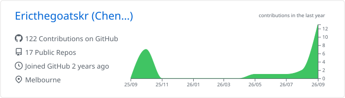
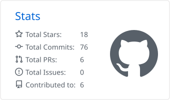
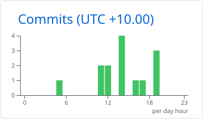
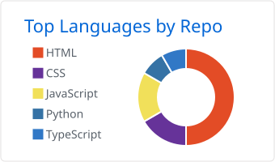
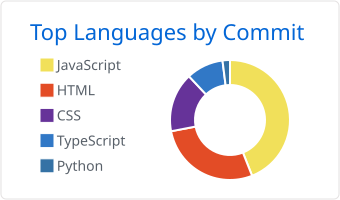

# 👋 你好，我是蔡承諺 Eric Tsai

[English](README.md) · **繁體中文**

**前端與資料工程 | 公開資料儀表板 | 電腦視覺**

🎓 蒙納許大學資訊科技碩士（Monash University, 墨爾本）| 🇹🇼 高雄 → 🇦🇺 墨爾本 
🏫 義守大學資訊工程系學士 
🔬 曾任環鴻科技（USI）資訊部 AI 實習生——工業安全影像辨識（YOLO） 
💡 用政府開放資料做儀表板，並把資料品質直接攤在頁面上

---

### 🛠️ 技術棧

**網頁** 

**資料與 AI** 

**行動端** 

**工具鏈** 

---

### 🚀 目前正在做

- 🅿️ **墨爾本路邊停車儀表板**——接市政府感測器即時資料，把故障的感測器排除掉，而不是當成空位計算
- 📊 **公開資料儀表板的可信度設計**——資料新鮮度狀態、驗證失敗時保守處理、並告訴讀者哪些資料被排除了
- 🎓 **蒙納許大學資訊科技碩士**——一邊上課一邊持續出貨側專案
- 🏀 運動數據，以及任何能把雜亂公開資料變成可行動資訊的東西

---

### ⭐ 精選專案

| 專案 | 內容 |
|---|---|
| [melbourne-parking-dashboard](https://github.com/Ericthegoatskr/melbourne-parking-dashboard) | 墨爾本市路邊停車即時查詢。排除 963 個已停止回報的感測器——把它們算進去會讓空位數虛報 11.4%（448 個幽靈車位）。React + TypeScript、40 個測試、每次 push 跑 CI（[線上](https://ericthegoatskr.github.io/melbourne-parking-dashboard/)） |
| [AquaSync](https://github.com/Ericthegoatskr/AquaSync) | 全台水庫水情監控——涵蓋各主要水庫蓄水狀況，每 5 分鐘更新，含 Chart.js 趨勢分析與地區篩選（[線上](https://ericthegoatskr.github.io/AquaSync/)） |
| [NBA-Data-Analysis](https://github.com/Ericthegoatskr/NBA-Data-Analysis) | NBA 數據爬蟲與分析工具，嚴格限定在 `robots.txt` 允許的路徑。以 pandas/matplotlib 產生報表與球員對比分析，並打包成桌面應用 |
| [scoreboard](https://github.com/Ericthegoatskr/scoreboard) | SwiftUI iOS 籃球計分板，適用正式比賽——自訂球隊與名單、個人數據統計、深色模式，完全離線運作不需網路 |
| [SkyGazer](https://github.com/Ericthegoatskr/SkyGazer) | 卡通風格天氣應用：即時天氣、五日預報與警報，響應式設計並支援鍵盤操作（[線上](https://ericthegoatskr.github.io/SkyGazer/weather2/)） |
| [foodmap2](https://github.com/Ericthegoatskr/foodmap2) | 基於 Google Maps + Places API 的美食地圖——定位搜尋、分類篩選、收藏店家，還有選不出來時用的輪盤抽選（[線上](https://ericthegoatskr.github.io/foodmap2/)） |

---

  
📈 GitHub 數據

   

  <picture>
    <source media="(prefers-color-scheme: dark)" srcset="./profile-summary-card-output/github_dark/0-profile-details.svg">
    <source media="(prefers-color-scheme: light)" srcset="./profile-summary-card-output/github/0-profile-details.svg">
    
  </picture>

  <picture>
    <source media="(prefers-color-scheme: dark)" srcset="./profile-summary-card-output/github_dark/3-stats.svg">
    <source media="(prefers-color-scheme: light)" srcset="./profile-summary-card-output/github/3-stats.svg">
    
  </picture>
  <picture>
    <source media="(prefers-color-scheme: dark)" srcset="./profile-summary-card-output/github_dark/4-productive-time.svg">
    <source media="(prefers-color-scheme: light)" srcset="./profile-summary-card-output/github/4-productive-time.svg">
    
  </picture>

  <picture>
    <source media="(prefers-color-scheme: dark)" srcset="./profile-summary-card-output/github_dark/1-repos-per-language.svg">
    <source media="(prefers-color-scheme: light)" srcset="./profile-summary-card-output/github/1-repos-per-language.svg">
    
  </picture>
  <picture>
    <source media="(prefers-color-scheme: dark)" srcset="./profile-summary-card-output/github_dark/2-most-commit-language.svg">
    <source media="(prefers-color-scheme: light)" srcset="./profile-summary-card-output/github/2-most-commit-language.svg">
    
  </picture>

  由 <a href="./.github/workflows/profile-summary-cards.yml">GitHub Actions</a> 每日重新產生並提交回本 repo——載入此頁時不會呼叫任何第三方服務。

---

### 📫 聯絡我

💼 正在尋找墨爾本的新鮮人職缺與實習機會——前端、資料，或任何介於兩者之間跟資料相關的工作

  

